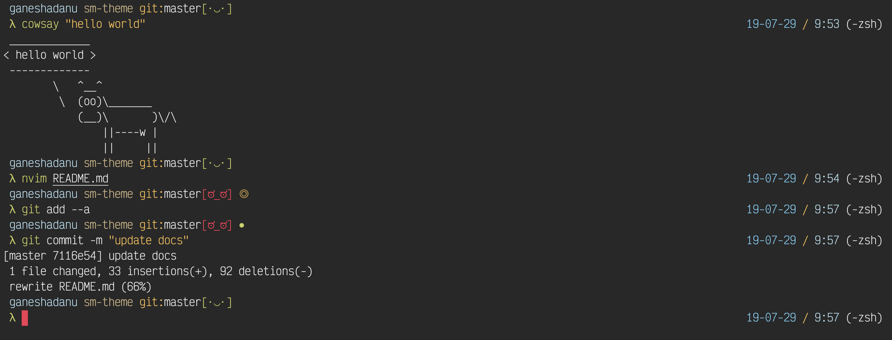

# sm-theme



⛓ a **Simplist** & **Minimalist** theme for your **favorite** terminal.

> ⚠️ This theme better fit with **Fira Code** font.

## Install

### 1. via Oh-My-Zsh

> I assume you have [Oh My Zsh](https://ohmyz.sh/) installed. If not, let's **get it** !

1. Install `sm.zsh-theme` in  `~/.oh-my-zsh` folder:

```bash
# at the root of this repository
> source install.sh --zsh
```

2. Update `ZSH_THEME` theme in your `.zshrc`

```bash
21    # See https://github.com/robbyrussell/oh-my-zsh/wiki/Themes
22    ZSH_THEME="sm" # probably was ZSH_THEME="robbyrussell (default)
23
24    # Set list of themes to pick from when loading at random
```

## License

Under [MIT](https://github.com/blyndusk/sm-theme/blob/master/LICENSE) license.
